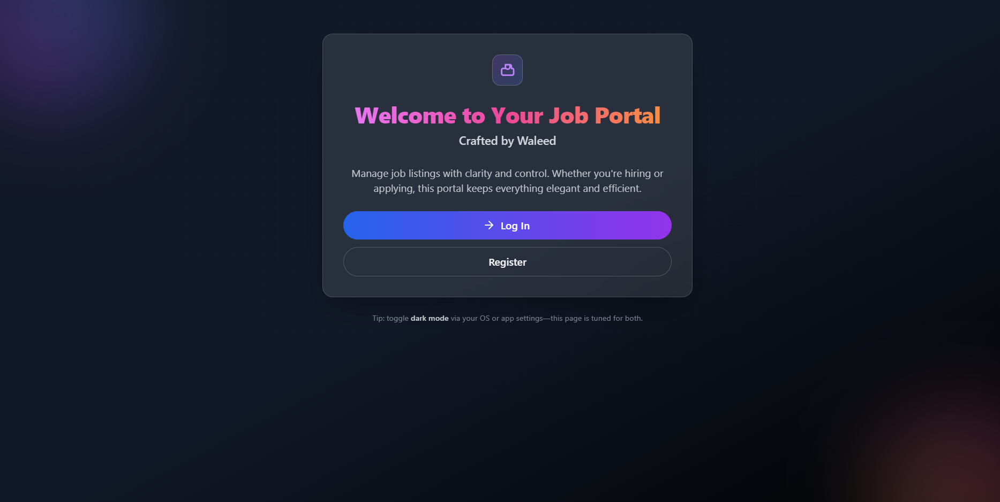
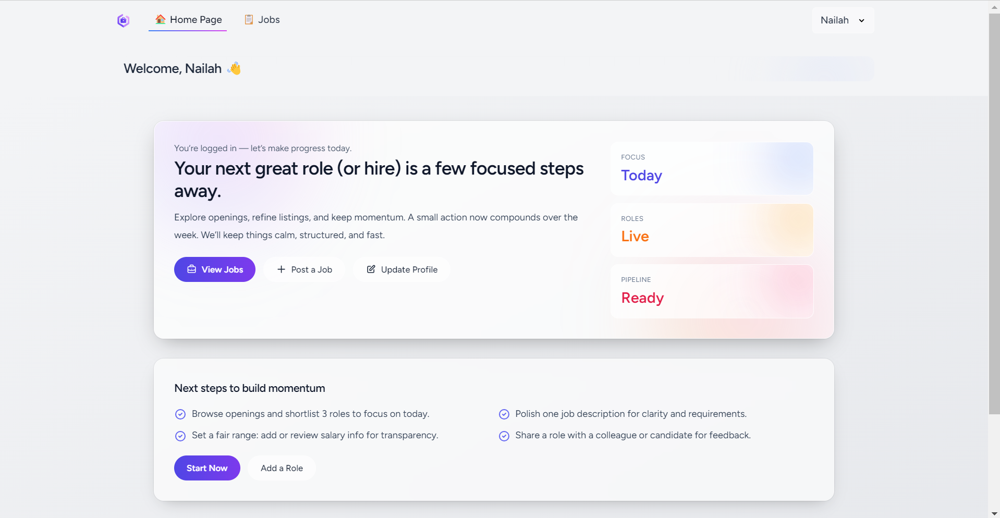
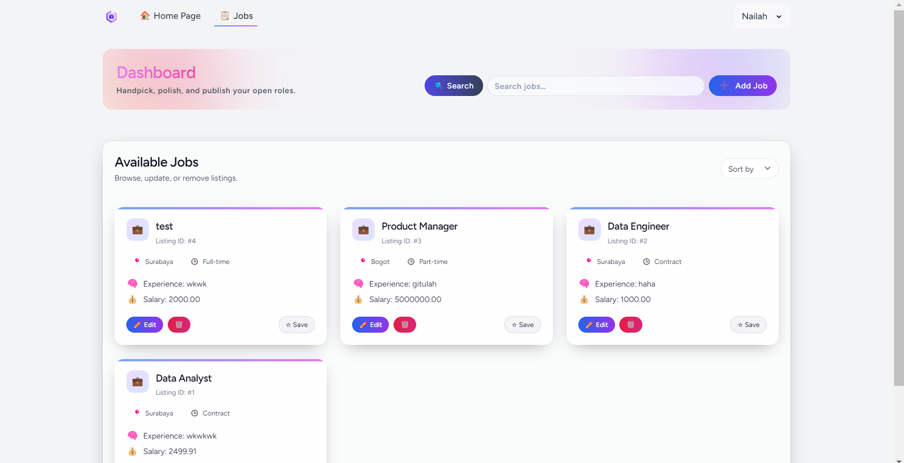
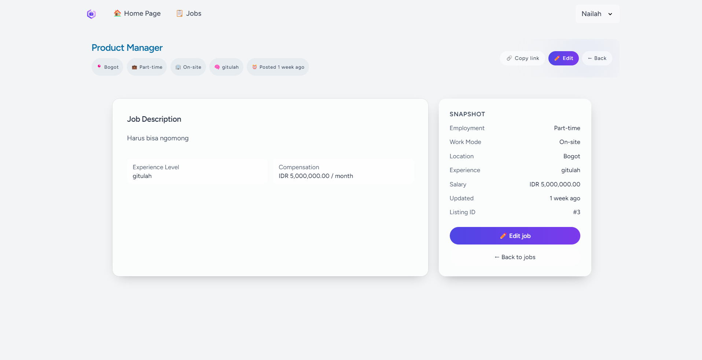
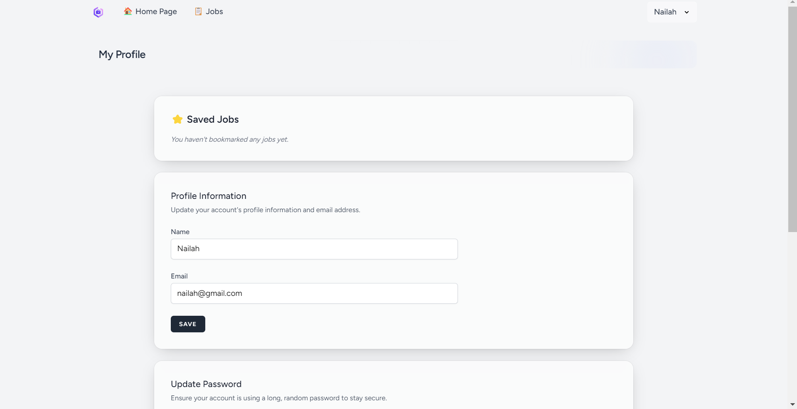

# 🚀 Laravel Job Dashboard

A clean, secure, and beautifully designed job management system built with **Laravel 12** and **Laravel Breeze**. This application allows users to add, edit, view, and delete job listings, featuring full authentication, profile management, and a highly polished UI out of the box.

---

## 📸 Screenshots

*   
*   
*   
*   
*   
---

## 🧰 Tech Stack

*   **Framework:** Laravel 12.x
*   **Language:** PHP 8.2+
*   **Authentication:** Laravel Breeze
*   **Frontend:** Tailwind CSS (Responsive UI with modern glassmorphism & hover effects)
*   **Assets Bundler:** Vite
*   **Database:** SQLite (Default, out of the box)

## ✨ Key Features

*   **💼 Job Management:** Seamlessly add, edit, view, and safely delete job listings.
*   **🔐 Authentication:** Login/Register via Breeze with Email verification support.
*   **👤 Profile Control:** Profile editing and secure password updates.
*   **🎨 Enhanced UI/UX:** Custom dashboard layouts, interactive stats cards with splash colors, and intuitive action buttons.

## ⚙️ Requirements

*   PHP 8.2 or higher
*   Composer
*   Node.js & NPM

## 🛠️ Installation & Setup

Follow these steps to get the project up and running on your local machine:

**1. Clone the repository:**
```bash
git clone [https://github.com/yourusername/jobs-management-system.git](https://github.com/yourusername/jobs-management-system.git)
cd jobs-management-system
```

**2. Install PHP & Node dependencies:**
```Bash
composer install
npm install
```

**3. Environment Setup:**
```Bash
Copy the .env.example file and generate the application key.
cp .env.example .env
php artisan key:generate
```

**4. Build Frontend Assets:**
```Bash
Compile the Tailwind CSS and other assets via Vite.
npm run build
```

**5. Database Setup (SQLite):**
Since this project uses SQLite by default, the database file will be created automatically. Just run the migrations (and seed the database if you want dummy data):
```Bash
php artisan migrate --seed
```

**6. Serve the Application:**
Start the Laravel development server.

```Bash
php artisan serve
```
